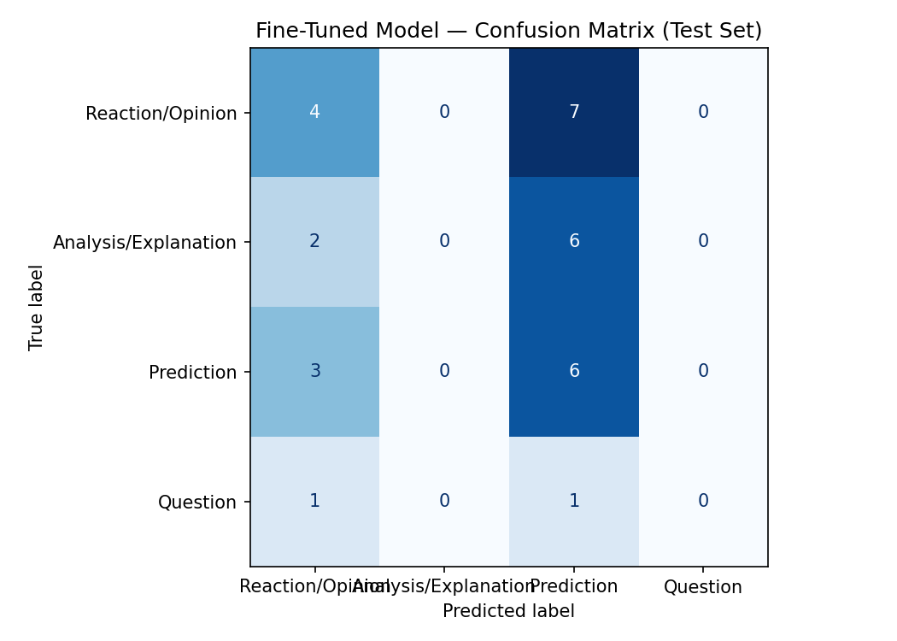

# TakeMeter: World Cup Discourse Classifier

TakeMeter is a text classification project for r/worldcup posts and comments. The goal is to classify World Cup discourse by what kind of comment it is: a quick fan reaction, a more evidence-backed explanation, a future prediction, or a question asking for help or opinions.

The project uses a labeled CSV dataset, a zero-shot Groq Llama baseline, and a fine-tuned `distilbert-base-uncased` classifier. The fine-tuned model did not beat the baseline, but the failure was useful: it showed that the model learned shallow wording cues, especially future-like words, instead of the intended discourse categories.

## Community

I chose r/worldcup because World Cup discussion has a wide range of text styles: emotional fan reactions, player and team analysis, future predictions, ticket/travel questions, and debates about past tournaments. This makes it a good fit for a classification task because the differences between post types matter to real users. A fan browsing the subreddit might want to separate hot takes from analysis, predictions, or practical questions.

## Label Taxonomy

### Reaction/Opinion

This label is for quick emotional reactions, judgments, hot takes, or unsupported opinions about a World Cup topic. The post may be strongly worded, but it does not provide much concrete evidence or reasoning.

Examples:

- "The Fox Sport graphics for this world cup is so bad bro. Just AI slop jammed into every pixel."
- "Yeah, New Zealand were robbed in 2019."

### Analysis/Explanation

This label is for posts that explain a claim using concrete reasoning, statistics, history, match events, player records, tactics, or comparisons. The claim can still be debatable, but the author gives reasons beyond a simple opinion.

Examples:

- "Kylian Mbappe reaches Miroslav Klose's goal record at the World Cup with 16 goals, closing in on Lionel Messi's record of 18 World Cup goals."
- "Ireland 2002 came from behind and drew with Germany in the group stage, then lost to Spain on penalties."

### Prediction

This label is for future-facing claims about what will, might, or could happen in a match, tournament, bracket, award race, player performance, qualification path, or future World Cup.

Examples:

- "Brazil vs Japan feels like one of those matches that could be much closer than people expect."
- "Mbappe will become the highest scorer and I predict his record will go unbroken for the next 30 or so years."

### Question

This label is for posts or comments whose main purpose is to ask for information, advice, clarification, predictions, opinions, tickets, travel help, logistics, or community input.

Examples:

- "Would anyone at the Bosnia match tomorrow be interested in a Seattle Sounders / Bosnia jersey swap?"
- "How hard is it to get Brazil match tickets in the First Come First Served phase?"

## Dataset

The dataset is stored at `data/takemeter_dataset.csv`. It contains 200 labeled examples with these columns:

```csv
text,label,notes
```

The data came from public r/worldcup posts and comments collected through a public Reddit archive endpoint. I focused on recent and controversial-looking posts/comments, then added additional real r/worldcup question posts because the first collection pass had too few questions.

Current label distribution:

| Label | Count |
|---|---:|
| Reaction/Opinion | 73 |
| Analysis/Explanation | 53 |
| Prediction | 56 |
| Question | 18 |
| **Total** | **200** |

No single label accounts for more than 70% of the dataset. The largest label, Reaction/Opinion, is 36.5% of the dataset.

### Labeling Process

I labeled each example according to the main communicative purpose of the text:

- If it asked for information or community input, I labeled it `Question`.
- If it made a future-facing claim, I labeled it `Prediction`.
- If it gave reasons, evidence, statistics, history, or match context, I labeled it `Analysis/Explanation`.
- If it mainly expressed a quick take or emotional judgment, I labeled it `Reaction/Opinion`.

Some examples were initially labeled with heuristic assistance and then reviewed. The final CSV keeps notes only for a small number of difficult cases.

### Difficult Labeling Examples

| Example | Possible Labels | Decision |
|---|---|---|
| "Predictions for Colombia v Congo? Hopefully Colombia wins." | Question, Prediction | `Question`, because the main purpose is asking others for predictions, even though the author adds a preferred outcome. |
| "I kept hearing CR7 is washed and should come off the bench?" | Reaction/Opinion, Question | `Question` if sincerely asking for clarification; `Reaction/Opinion` if used rhetorically. The annotation rule prioritizes the main purpose of the post. |
| "The Fox Sport graphics for this world cup is so bad bro. Just AI slop jammed into every pixel." | Reaction/Opinion, Analysis/Explanation | `Reaction/Opinion`, because it is an evaluative take without concrete evidence. |
| "Current projected Round of 32 based on today's standings... Which matchup would you most want to see?" | Prediction, Question | `Prediction` if the post's substance is the projected bracket; `Question` if the bracket is only background for asking user preferences. |

## Fine-Tuning Pipeline

I fine-tuned `distilbert-base-uncased` using the Hugging Face `Trainer` workflow in Google Colab. The dataset was split automatically into train, validation, and test sets, and the same test set was used for the zero-shot baseline and fine-tuned model evaluation.

Training configuration:

```python
num_train_epochs=3
learning_rate=2e-5
per_device_train_batch_size=16
per_device_eval_batch_size=32
weight_decay=0.01
warmup_steps=50
```

I used 3 epochs because the dataset is small and I wanted to avoid overfitting a noisy 200-example dataset while still giving the new classification head enough passes to learn the label boundaries. I kept the learning rate at `2e-5`, a conservative fine-tuning rate for DistilBERT, so the pretrained language features would not be overwritten too aggressively. I used batch size 16 because it fit comfortably in the Colab runtime and gave more stable updates than a very small batch. Validation accuracy improved across epochs from 0.267 to 0.533, so the model was learning something during training. However, test performance was poor, which suggests the issue was not simply that training failed; the model learned the wrong cues from a small and imbalanced dataset.

Validation log:

| Epoch | Training Loss | Validation Loss | Accuracy |
|---:|---:|---:|---:|
| 1 | No log | 1.383713 | 0.266667 |
| 2 | 1.392483 | 1.364541 | 0.333333 |
| 3 | 1.383210 | 1.334265 | 0.533333 |

## Baseline

The baseline used Groq's `llama-3.3-70b-versatile` in a zero-shot classification setup. The prompt defined the four labels, gave one example per label, and instructed the model to output only one exact label string.

Baseline prompt summary:

```text
You classify r/worldcup Reddit posts and comments into exactly one label.

Valid labels:
Reaction/Opinion
Analysis/Explanation
Prediction
Question

Definitions:
Reaction/Opinion = quick emotional reaction, judgment, hot take, or unsupported opinion.
Analysis/Explanation = reasoning or explanation using evidence, statistics, history, match events, tactics, or comparisons.
Prediction = future-facing claim about what will, might, or could happen.
Question = asks for information, advice, clarification, predictions, opinions, tickets, travel help, logistics, or community input.

Return exactly one valid label and nothing else.
```

I also updated the parser to compare lowercased model output against lowercased label names, then return the original label string. This fixed unparseable responses caused by capitalization differences.

## Evaluation Results

Both models were evaluated on the same 30-example test set.

Saved evaluation artifacts:

- `evaluation_results.json`: summary of baseline accuracy, fine-tuned accuracy, improvement, test set size, label map, and model name.
- `confusion_matrix.png`: image version of the fine-tuned model confusion matrix.
- The markdown tables below are the text version of the same evaluation results so the report is readable without opening image files.

| Model | Accuracy | Macro F1 | Weighted F1 |
|---|---:|---:|---:|
| Zero-shot Groq Llama baseline | 0.533 | 0.55 | 0.45 |
| Fine-tuned DistilBERT | 0.333 | 0.20 | 0.26 |

The fine-tuned model performed worse than the baseline by 20 percentage points in accuracy.

### Baseline Metrics

| Label | Precision | Recall | F1 | Support |
|---|---:|---:|---:|---:|
| Reaction/Opinion | 0.50 | 1.00 | 0.67 | 11 |
| Analysis/Explanation | 0.50 | 0.25 | 0.33 | 8 |
| Prediction | 0.50 | 0.11 | 0.18 | 9 |
| Question | 1.00 | 1.00 | 1.00 | 2 |

The baseline over-detected Reaction/Opinion and struggled with Prediction and Analysis/Explanation. The Question score looks perfect, but there were only 2 question examples in the test set, so that result is not very reliable.

### Fine-Tuned Metrics

| Label | Precision | Recall | F1 | Support |
|---|---:|---:|---:|---:|
| Reaction/Opinion | 0.40 | 0.36 | 0.38 | 11 |
| Analysis/Explanation | 0.00 | 0.00 | 0.00 | 8 |
| Prediction | 0.30 | 0.67 | 0.41 | 9 |
| Question | 0.00 | 0.00 | 0.00 | 2 |

The fine-tuned model never predicted `Analysis/Explanation` or `Question` on the test set. It mostly predicted `Reaction/Opinion` and `Prediction`, which shows that the model collapsed the four-class taxonomy into a weaker two-class pattern.

### Confusion Matrix

Rows are true labels. Columns are predicted labels.

| True \ Predicted | Reaction/Opinion | Analysis/Explanation | Prediction | Question |
|---|---:|---:|---:|---:|
| Reaction/Opinion | 4 | 0 | 7 | 0 |
| Analysis/Explanation | 2 | 0 | 6 | 0 |
| Prediction | 3 | 0 | 6 | 0 |
| Question | 1 | 0 | 1 | 0 |

The saved image version is also included as `confusion_matrix.png` and embedded below.



## Error Analysis

### Error 1: Analysis/Explanation predicted as Prediction

Text:

```text
It isn't complex. It's just ridiculous to say it's a missed opportunity after going out in the groups. All of your examples do not fit the argument as they qualified from the group.
```

True label: `Analysis/Explanation`  
Predicted label: `Prediction`

This example is explaining why another user's argument does not fit. It refers to group-stage qualification and compares examples, which makes it analysis. The model likely focused on sports-debate language and missed the fact that the author was reasoning about past tournament outcomes rather than forecasting a future event.

### Error 2: Reaction/Opinion predicted as Prediction

Text:

```text
Every single goal is a piece of art, we will rarely see something similar in any World Cup.
```

True label: `Reaction/Opinion`  
Predicted label: `Prediction`

This is mostly praise and emotional evaluation. The phrase "we will rarely see" is future-facing, so the model treated it as Prediction. This shows a shallow cue: the model learned that words like "will" often signal Prediction, even when the main purpose is still a reaction.

### Error 3: Analysis/Explanation predicted as Prediction

Text:

```text
I agree with Belgium 2018. Had it not been for France in the semis, Belgium would have won that tournament and probably beaten Croatia.
```

True label: `Analysis/Explanation`  
Predicted label: `Prediction`

This is a counterfactual analysis of a past tournament. It uses hypothetical language like "would have won," but the topic is still explaining Belgium's 2018 World Cup outcome. The model appears to confuse hypothetical wording with future prediction.

### Error 4: Reaction/Opinion predicted as Prediction

Text:

```text
Why are we so desperate to defend Suarez? I would assume that we aren't.
```

True label: `Reaction/Opinion`  
Predicted label: `Prediction`

This is a rhetorical question and opinion about a controversial player situation. The model likely picked up "would" and the question structure, but the post is not asking for information and not predicting a future event.

## What The Model Learned vs. What I Intended

I intended the model to learn discourse purpose: reaction, analysis, prediction, or question. Instead, the fine-tuned model appears to have learned shallow lexical cues. The clearest pattern is that future-like or conditional words such as "will," "would," "might," and "if" pushed examples toward `Prediction`, even when the post was actually a reaction or a historical explanation.

The model also failed to learn `Question`, partly because the dataset had only 18 question examples overall and only 2 in the test set. It also failed to learn `Analysis/Explanation`, which suggests that my boundary between analysis and opinion was too subtle for a 200-example dataset. Many sports comments mix evidence with strong opinion, and DistilBERT did not reliably separate those signals.

The main fix would be dataset improvement rather than more training. I would collect more real question examples, balance the four labels closer to 50 examples each, and relabel borderline Prediction vs. Analysis examples more carefully.

## Sample Classifications

These are representative examples from the evaluation/debugging run.

| Text | True Label | Model Prediction | Confidence | Notes |
|---|---|---|---:|---|
| "Every single goal is a piece of art, we will rarely see something similar in any World Cup." | Reaction/Opinion | Prediction | 0.27 | Incorrect; the model over-focused on "will." |
| "I agree with Belgium 2018. Had it not been for France in the semis..." | Analysis/Explanation | Prediction | 0.29 | Incorrect; counterfactual analysis was mistaken for future prediction. |
| "They will be lucky if they get out of the group stage with how they have been playing." | Prediction | Prediction | N/A | This is a reasonable Prediction example because the main claim is about a future tournament outcome. |
| "How hard is it to get Brazil match tickets in the First Come First Served phase?" | Question | N/A | N/A | This is the kind of practical information-seeking post the model needed more training examples for. |

## Definition of Success

My original target was at least 65% fine-tuned accuracy, macro F1 of at least 0.60, no label below 0.50 F1, and improvement over the zero-shot baseline. The final model did not meet that threshold. It reached only 33.3% accuracy and 0.20 macro F1, while the baseline reached 53.3% accuracy and 0.55 macro F1.

Even though the model failed the target, the evaluation was still useful because it revealed a specific mismatch between the intended labels and what the model learned.

## Spec Reflection

The spec helped by forcing the label taxonomy and edge cases to be written before training. That made it easier to diagnose the failure later: the problem was not just "bad accuracy," but a specific failure to distinguish Prediction from Analysis/Explanation and Reaction/Opinion.

The implementation diverged from the plan in the dataset. I planned for a balanced 50/50/50/50 split, but the final dataset had many more Reaction/Opinion examples and far fewer Question examples. This happened because real r/worldcup data had many casual reactions and fewer clean question posts in the archive collection. That imbalance likely contributed to the model never predicting Question on the test set.

## AI Usage

I used AI assistance in several specific ways:

1. **Label stress-testing and taxonomy revision**
   I asked Codex to review the first taxonomy and suggest edge cases. The original labels had a broad `Discussion` class, which would have swallowed too many sports comments. I revised the taxonomy into `Reaction/Opinion`, `Analysis/Explanation`, `Prediction`, and `Question`.

2. **Data collection and preliminary labeling support**
   I used Codex to help collect public r/worldcup examples through a Reddit archive endpoint and organize them into the required CSV format. Some labels were initially assigned using heuristic rules, then I manually inspected and corrected examples, cleaned the notes column, and added real question examples from r/worldcup.

3. **Baseline prompt and parsing fix**
   I used Codex to draft a stricter Groq baseline prompt and identify why responses were initially unparseable. The parser was lowercasing model output but comparing against capitalized label strings, so I updated the parsing logic to compare lowercased versions and return the original label.

4. **Failure analysis**
   I used AI assistance to interpret the wrong predictions and confusion matrix. I then verified the pattern myself: the fine-tuned model was overusing `Prediction`, especially for comments containing future-like or conditional words.
